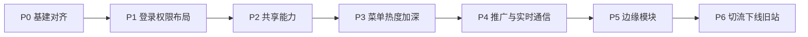

# cloudPlatform → vben-cloud-platform 改版方案

> **源项目：** `../cloudPlatform`（Vue 2.7 + Element UI + Webpack）  
> **目标项目：** 本仓库 `vben-cloud-platform`（Vue 3 + Ant Design Vue + Vite，基于 [vue-vben-admin 5.7.0](https://github.com/vbenjs/vue-vben-admin) 裁剪）  
> **仓库地址：** https://github.com/leoharley559/vben-cloud-platform  
> **SSH 克隆（推荐，多 GitHub 账号环境）：** `git@github-leoharley559:leoharley559/vben-cloud-platform.git`  
> **SSH 克隆（标准）：** `git@github.com:leoharley559/vben-cloud-platform.git`

---

## 目录

1. [一句话结论](#1-一句话结论)
2. [关键决策（开工前定死）](#2-关键决策开工前定死)
3. [总体路线图](#3-总体路线图)
4. [P0：基建对齐](#4-p0基建对齐)
5. [P1：登录 / 权限 / 布局](#5-p1登录--权限--布局)
6. [P2：共享能力](#6-p2共享能力)
7. [业务模块迁移顺序](#7-业务模块迁移顺序)
8. [单模块标准作业流程](#8-单模块标准作业流程)
9. [团队分工与协作](#9-团队分工与协作)
10. [验收与切流](#10-验收与切流)
11. [立即执行的 7 步](#11-立即执行的-7-步)
12. [风险清单](#12-风险清单)
13. [附录：模块对照表](#13-附录模块对照表)

---

## 1. 一句话结论

这不是「换皮」，而是 **Vue2 + Element UI → Vue3 + Ant Design Vue 的全量重写**。`cloudPlatform` 主应用约 **1200+ 页面 / 20+ 业务域**；本仓库作为新前端壳，按模块将功能复刻进去。`cloudPlatform/hm-hrms` 已是 Vben 技术栈，建议 **单独评估合并或保持独立**，不要与主后台混迁。

---

## 2. 关键决策（开工前定死）

| 决策项 | 建议 | 原因 |
| --- | --- | --- |
| 目标仓库 | 本仓库 `vben-cloud-platform` | 模版已裁剪干净，业务只写 `apps/web-antd/src/` |
| 权限模式 | **`backend`（后端菜单）** | 旧系统登录后由 `getUserInfo → Nav` 动态生成路由，与现网 RBAC 一致 |
| UI 组件库 | Ant Design Vue（模版默认） | Element → AntD 需逐页改写，不能直接拷贝 `.vue` |
| API 策略 | **接口契约尽量不动**，只换前端 | 成本可控；加解密、Token、错误码对齐旧 `request.js` |
| 迁移策略 | **按业务域分批上线**（可双端并行） | 全量一次切换风险过高 |
| hm-hrms | **Phase 0 单独立项**：合并进 monorepo 或继续独立部署 | 已是 Vue3 + Vben，与主应用无代码耦合 |

---

## 3. 总体路线图



> **现行原则（已调整）**：业务加深顺序对齐**左侧一级菜单使用频率**，不再按「系统→游戏→运营」旧批序硬推。系统管理已基本完成，作为底座保留；客服/币商/WS 等仍单独排期。

| 阶段 | 目标 | 预估周期 | 验收标准 |
| --- | --- | --- | --- |
| **P0** | 环境、请求层、加密、环境变量、目录规范 | 1–2 周 | 能连现网/测试 API，打通登录 + 菜单 |
| **P1** | 登录多入口、权限、布局、全局配置 | 2–3 周 | 登录后菜单与旧站一致，按钮权限可用 |
| **P2** | 全局组件、工具、i18n、玩家详情骨架 | 2–4 周 | 列表页「筛选 + 表格 + 分页」有标准范式 |
| **P3** | **按左侧菜单热度加深**：数据汇总 → 日常运营 → 会员 → 产品 → 代理 → 报表/分析；系统管理已基本完成作底座 | 最长 | 菜单一级模块主流程可操作 |
| **P4** | 推广管理 + 客服/币商/聊天室/直播（WS） | 高难度 | 推广可操作；实时链路可联调 |
| **P5** | 电销 + 移动端 H5 + 体育 + 收尾 | 中 | 边缘模块可用 |
| **P6** | 灰度切流、旧站下线、文档归档 | 1–2 周 | 正式环境只走新前端 |

---

## 4. P0：基建对齐

### 4.1 仓库与目录

业务代码**只写在** `apps/web-antd/src/`：

```text
apps/web-antd/src/
├── api/                 # 按业务域：systemManage、gameManage、operationManage...
├── types/               # 按域类型定义
├── views/               # 按域页面（路径尽量对齐旧 Router 字段，方便 backend 菜单映射）
├── router/routes/modules/   # frontend/mixed 模式用；backend 模式可少写静态业务路由
├── composables/
├── components/          # 业务共享组件
├── utils/               # crypto、formatAmount、permission 等
└── locales/langs/
```

### 4.2 请求层对齐（必做）

对照旧文件：`cloudPlatform/src/utils/request.js`、`crypto.js`、`auth.js`

| 能力 | 旧实现 | 新落点 |
| --- | --- | --- |
| baseURL / 代理 | `BASE_API` | `.env.*` + `vite.config.ts` 代理 |
| Token | Cookie `Cloud-Token` | 统一到 `accessStore`，请求头对齐后端约定 |
| AuthToken 刷新 | App 内约 290s 轮询 | `auth` store / 定时任务 |
| AES 加解密 | 生产环境加密 | `utils/crypto.ts` + `api/request.ts` 拦截器 |
| Language | Header `Language` | 请求拦截器注入 |
| 错误码 | `errorCodeMapping.js` | 响应拦截器 |
| 成功码 | 旧业务约定 | `VITE_API_SUCCESS_CODE` |

**验收**：用测试账号登录真实/测试环境，拿到用户信息与菜单。

### 4.3 权限模式切到 backend

1. 在 `apps/web-antd/src/preferences.ts` 设置 `accessMode: 'backend'`
2. 对接旧 `getUserInfo` 的 `Nav` → 适配成 Vben `/menu/all` 结构，或写 **Nav → Vben Route** 转换层（对标旧 `store/modules/permission.js` 的 `populateChildrenVeaStyle`）
3. 组件路径映射：后端 `Router` 字段 → `views/**/*.vue`（路径命名尽量与旧 `views/` 一致，减少映射表）

### 4.4 环境变量迁移

从旧 `cloudPlatform/config/*.env.js` 迁移，至少包括：

- `BASE_API`
- `VOIP_BASE_API`
- `WBSOCKT_URL` / `MJ_WBSOCKT_URL`（客服）
- `BS_WBSOCKT_URL` / `BS_MJ_WBSOCKT_URL`（币商）
- `GATEWAY_CONFIG`（聊天室）
- `UPLOAD_URL` / `UPLOAD_IMG` / `UPLOAD_MD5_IMG` / `UPLOAD_URL_CS`
- `SERVICE_IMG` / `STATIC_FOREIGN`
- `KEY` / `IV`（AES）
- `PROJECT_NAME`、`VERSION_NUMBER` 等

全部改为 `VITE_*` 前缀，写入 `apps/web-antd/.env.development` / `.env.production`。

---

## 5. P1：登录 / 权限 / 布局

### 5.1 登录多入口

| 旧路由 | 说明 | 新建议 |
| --- | --- | --- |
| `/login` | 标准登录 | `/auth/login` 对接 `/public/user/login` |
| `/plogin` | Web 登录 | 独立认证页 |
| `/teamlogin` | 团队登录 | 独立认证页 |
| `/mlogin` `/mobilelogin` | 移动端 | 可后置到 P6，或单独 H5 应用 |

对接文件：`api/core/auth.ts`、`store/auth.ts`、`views/_core/authentication/login.vue`

### 5.2 权限双轨对齐

| 旧机制 | 新机制 |
| --- | --- |
| 菜单：后端 Nav | `backend` 动态路由 |
| `GLOBAL.checkPermission(menuId)` | `hasAccessByCodes` / 封装同名工具 |
| `checkPermissionByKey` + 各模块 `permissionKeyList` | 权限码写入 `accessCodes`，`v-access:code` |
| 独服/混服/推广层级/业主 v2 条件菜单 | **保留在菜单适配层**（不要散落页面） |

条件菜单逻辑参考旧 `cloudPlatform/src/store/modules/permission.js`：

- `everydayData` / `promoteData` / `timeshareData` — 按 `RoleDataField.HaveFunction`
- `stockManage` / `playerControl` — 仅独服 + 杀分权限
- `sonGameManage` — 仅独服
- `cloneChannel` — 仅二级推广
- `gameManage` / `dropDeploy` — 仅一级推广
- `virtualReport` — 仅业主版本 v2

### 5.3 布局定制

旧：Sidebar + Navbar + TagsView（vue-element-admin）  
新：Vben `BasicLayout`（Tab、主题、锁屏已有）

需额外定制：

- 二次验证（旧 `views/layout/`）
- 个人中心业务字段
- 水印（旧 `utils/waterMark.js`）
- 消息通知（旧 `messageLog` store）

---

## 6. P2：共享能力

### 6.1 必须先迁移的共享件

| 优先级 | 旧能力 | 新落点 |
| --- | --- | --- |
| P0 | ChannelSelect / PackageSelect / AccountSelect / FilterForm | `components/global/` |
| P0 | 金额 / 大数 / 日期工具 | `utils/` |
| P0 | 权限工具 | `utils/permission.ts` |
| P1 | Excel 导入导出 | 基于 `components/Excel/` 或 `xlsx` |
| P1 | 图片上传/裁剪 | 对接 `UPLOAD_*` |
| P1 | 语言群组 LanguageGroup | 组件 + store |
| **P0** | **玩家详情 `common/playerDetail/`（50+ 子组件）** | 独立子工程级模块，多处复用 |

### 6.2 页面范式（强制统一）

每个列表页统一：

1. `types/<域>Types.ts`
2. `api/<域>/xxx.ts`（`requestClient`）
3. `views/<域>/xxx/index.vue`：筛选用 `useVbenForm`，表格用 `useVbenVxeGrid`
4. i18n：`locales/langs/zh-CN/...`

旧项目里已有 `composables/` + Zod 的新代码，**优先移植这些**，比 Options API 页面更容易迁。

### 6.3 Element UI → Ant Design Vue 对照

| Element UI      | Ant Design Vue / Vben      |
| --------------- | -------------------------- |
| `el-table`      | `Table` / `useVbenVxeGrid` |
| `el-form`       | `Form` / `useVbenForm`     |
| `el-dialog`     | `Modal` / `Drawer`         |
| `el-pagination` | 表格内置分页               |
| `v-permission`  | `v-access:code`            |

---

## 7. 业务模块迁移顺序（按左侧菜单）

> 菜单中文名来自旧站 `lang`：`operationalData=数据汇总`、`operationalManage=日常运营`、`memberManage=会员管理`、`gameManage=产品管理`、`netcash=代理管理`、`dataClose=报表/分析`、`systemManage=系统管理`。

### 菜单驱动优先级（现行）

| 序 | 左侧菜单 | 代码域 | views | 当前状态 | 下一刀建议 |
| --- | --- | --- | --- | --- | --- |
| 1 | **数据汇总** | 运营数据 | `operationalData/` | MVP 顶层齐（多为只读报表） | 核对筛选/导出/金额单位；补缺失汇总页与对拍 |
| 2 | **日常运营** | 运营管理 | `operationalManage/` | 写操作已深；含公告/邮件创建编辑、积分调整提交+审核 PassPopup(83) | 活动创建向导暂缓；公告富文本多语言 |
| 3 | **会员管理** | 会员管理 | `memberManage/` | 钱包/称号齐；玩家列表批量+备注；导出 PassPopup(34/35/90/95) | 对拍剩余 |
| 4 | **产品管理** | 游戏管理 | `gameManage/` | 出款银行+提现账户 CRUD MVP + 返水增删 + 兑换码生成 + 充值通用规则（堵塞提示/姓名数量/首存最低/取消设置） | 签约账户；包体/渠道创建向导；充值方式次数/通道报警 |
| 5 | **代理管理** | 代理网赚 | `netcash/` | 提款/佣金/红利/额度/代理新建编辑；DK；团队+副线；下级改线；详情手机/佣金；财务支付宝账户 CRUD | 批量转代；银行卡/USDT 账户；代理分组树 CRUD |
| 6 | **报表/分析** | 数据闭环 | `dataClose/` | MVP 顶层齐 | 核对导出与口径；LTV/统计页对拍 |
| 7 | **系统管理** | 系统管理 | `systemManage/` | **表单加深基本完成** | 仅修 bug / 权限对拍，不再优先新功能 |

**同批穿插（不挡主线）**

| 菜单/域 | 说明 |
| --- | --- |
| 推广管理 `generalizeManage/` | 已有团队推广向导 + 提现账号 SMS；可在代理管理之后穿插 |
| 客服/币商/聊天室/直播 | WS 专项，仍独立排期，不插入菜单热度主线前段 |

### 历史批次对照（归档，不再作为执行序）

<details>
<summary>原批 1–4 划分（已由上方菜单序替代）</summary>

#### 批 1 — 底座业务（P3）

| 序号 | 模块 | 旧 views 路径 | 旧 api 路径 | 页面量级 |
| --- | --- | --- | --- | --- |
| 1 | 仪表盘 | `views/dashboard/` | `api/dashboard/` | 11 |
| 2 | 系统管理 | `views/systemManage/` | `api/systemManage/` | 18 |
| 3 | 游戏管理 | `views/gameManage/` | `api/gameManage/` | 165 |
| 4 | 运营管理 | `views/operationalManage/` | `api/operationManage/` | 267 |

#### 批 2 — 资金与推广（P4）

| 序号 | 模块     | 旧 views 路径             | 旧 api 路径         | 页面量级 |
| ---- | -------- | ------------------------- | ------------------- | -------- |
| 5    | 代理网赚 | `views/netcash/`          | `api/netcash/`      | 107      |
| 6    | 推广管理 | `views/generalizeManage/` | `api/promotion/`    | 13       |
| 7    | 会员管理 | `views/memberManage/`     | `api/memberManage/` | 27       |

#### 批 3 — 实时通信（P5）

客服 / 币商 / 聊天室 / 直播（WS + Protobuf）

#### 批 4 — 数据与边缘（P6）

运营数据 / 数据闭环 / 推广数据 / 电销 / 体育 / H5

</details>

### ~~批 5 — HRMS~~（**不在本次云后台改版范围**）

- 路径：`cloudPlatform/hm-hrms/`（人事/考勤/排班等，独立 Vue3 应用）
- **本次不迁移、不合并、不做评估**；与云后台运营业务解耦，后续如需再单独立项

---

## 8. 单模块标准作业流程

每个业务域按此清单打勾：

```text
□ 1. 列出旧 views 子目录 + 对应 api 文件（做对照表）
□ 2. 导出/整理 OpenAPI 到 api-docs/swagger/<域>.openapi.json
□ 3. 写 types + api（只换封装，不改路径语义）
□ 4. 菜单组件路径能映射到新 views（backend 模式）
□ 5. 列表页：筛选 + 表格 + 分页 + 导出
□ 6. 表单页/弹窗：校验（优先 Zod）
□ 7. 按钮权限：对齐旧 permissionId / permissionKey
□ 8. 与旧站同环境对拍：关键接口参数与展示字段
□ 9. 补 i18n（至少中文；旧站有 8 语种则分批）
□ 10. Code Review + 该域冒烟用例签字
```

---

## 9. 团队分工与协作

| 角色        | 负责                                |
| ----------- | ----------------------------------- |
| 基建 1–2 人 | P0–P2：请求/权限/全局组件/玩家详情  |
| 业务组 A    | 系统管理 + 游戏管理                 |
| 业务组 B    | 运营管理（含活动）                  |
| 业务组 C    | 代理 + 推广 + 会员                  |
| 业务组 D    | 客服/币商/聊天室/直播（需 WS 经验） |
| 业务组 E    | 报表 + 电销 + H5                    |

**分支策略**：`main`（基建） / `feat/<域>` / 定期合入；禁止改 `packages/` 除非框架升级。

**双端并行**：新前端挂测试域名，旧站继续生产；按菜单灰度切换。

---

## 10. 验收与切流

1. **功能对拍表**：旧菜单树 vs 新菜单树 100% 覆盖（含条件菜单）
2. **权限对拍**：同一账号按钮显隐一致
3. **关键链路**：登录、充提审核、玩家详情、代理佣金、客服发消息
4. **性能**：首屏、大表格、活动配置页
5. **灰度**：按角色/渠道切部分用户到新前端
6. **下线**：DNS/静态资源切到新构建；旧 `cloudPlatform` 归档只读

---

## 11. 立即执行的 7 步

1. **确认仓库**：本仓库已更名为 `vben-cloud-platform`，团队统一 clone 地址
2. **定权限模式 = backend**，开写 `Nav → Vben 菜单` 适配层
3. **移植 `request` + `crypto` + Token/AuthToken**，联调真实登录
4. **落地全局组件与列表页脚手架**（ChannelSelect + Form + Grid 模板页）
5. **做模块对照表**（飞书/Excel）：域 | 旧页面路径 | 旧 API | 优先级 | Owner | 状态
6. **按左侧菜单热度加深**：数据汇总 → 日常运营 → 会员 → 产品 → 代理 → 报表/分析；系统管理仅维护
7. **客服/币商 WebSocket 专项**单独排期，避免拖死主线

---

## 12. 风险清单

| 风险 | 说明 | 缓解 |
| --- | --- | --- |
| 体量巨大 | 1200+ 页无法一次性搬完 | 分域交付，双端并行 |
| 本质是重写 | Vue2 Options + Element → Vue3 + AntD | 建立页面范式，禁止直接拷贝 |
| 实时模块 | 客服/聊天室/币商依赖 Protobuf + 多 WS | 独立专项，先抽 WS 层 |
| 条件权限 | 独服/混服/推广层级逻辑复杂 | 集中在菜单适配层 |
| i18n | 旧站 8 语种 | 先中文上线，再补语言包 |
| API 命名不一致 | views 用 `operationalManage`，api 用 `operationManage` | 对照表明确标注 |

---

## 13. 附录：模块对照表

> 用于跟踪迁移进度，建议在项目管理工具中维护在线版本。

| 域 | 旧 views | 旧 api | 页面数 | 优先级 | 阶段 | 负责人 | 状态 |
| --- | --- | --- | --- | --- | --- | --- | --- |
| 仪表盘 | `dashboard/` | `dashboard/` | 11 | P1 | P3 |  | **数据总览对拍**：Panel 指标卡+折线/柱图+自选日期、banner 四卡、充值成功率/提现时效/在线风控、游戏/玩家盈亏、渠道今日表+导出；在线总览另页 |
| 系统管理 | `systemManage/` | `systemManage/` | 18 | **菜单#7** | P3 |  | **表单加深基本完成**；仅修 bug / 对拍 |
| 游戏管理 | `gameManage/` | `gameManage/` | 165 | **菜单#4** | P3 |  | 表单加深续：三方代付密钥+通道费率/限额、VIP升级系数/图标方案+行编辑、返水配置/规则/手动发放/批量审核+方案增删、包体备注、渠道邀请码、出款银行开关/批量、提现账户普通支付宝增删改、兑换码随机生成、充值通用规则·堵塞提示(11139)+姓名数量(11140)+首存最低(13115)+取消设置(11613) |
| 运营管理 | `operationalManage/` | `operationManage/` | 267 | **菜单#2** | P3 |  | 写操作：公告/邮件（含创建编辑 MVP，删除权限对齐 10076）/票券/红利/排行榜/礼品/活动下架；滚动大奖；玩家详情全套 + 游戏风控 + 通道充值补单/补空单 + 充值黑名单 + 充值失败记录/CP补单 + 提现全套（含出款到账异常）+ 导出 PassPopup(17) + 调账审核 PassPopup(49) + 积分调整提交/审核 PassPopup(83)；活动创建向导/公告富文本多语言暂缓 |
| 运营数据 | `operationalData/` | `operationalData/` | 34 | **菜单#1** | P3 |  | 对拍加深：日期格式(YYYY-MM-DD)/默认区间、渠道 SearchType、充值字段 SumPayMergerMoney、投注报表列、老板日报 TimeNumber+员工统计列、公司日报汇总卡片；导出/渠道筛选待续 |
| 数据闭环 | `dataClose/` | `dataClose/` | 85 | **菜单#6** | P3 |  | MVP 顶层齐（含 LTV）；报表对拍待加深 |
| 推广数据 | `generalizeData/` | `generalizeData/` | 13 | P2 | P4 |  | MVP 顶层齐 |
| 推广管理 | `generalizeManage/` | `promotion/` | 13 | P1 | P4 |  | MVP 顶层齐；代理设定支持单条编辑/批量设置/恢复默认；新增团队推广向导（addPromote）+ 列表入口（10912）；提现账号增删改 + 短信验证码 |
| 代理网赚 | `netcash/` | `netcash/` | 107 | **菜单#5** | P3 |  | MVP 顶层齐；写操作加深：提款开始/通过/拒绝 + 黑名单删除、佣金行发放/一键发放、代理新建编辑、红利发放+审核、额度申请/审核（代理+平台）；DK；团队+副线；下级改线；详情手机(11258)+佣金(11501)+财务支付宝账户增删改(11260/61/62) |
| 币商管理 | `coinDealer/` | `coinDealer/` | 45 | P2 | P4 |  | MVP 列表/Tab；WS 工作台占位 |
| 客服管理 | `serviceManage/` | `serviceManage/` | 95 | P2 | P4 |  | 工作台薄切片（连接/聊天/发文本/忙碌/接单/转单/结束）+ 进线监控插话转单 |
| 聊天室 | `chatroomManage/` | `chatroomManage/` | 90 | P2 | P4 |  | MVP 顶层齐；进房 WS 占位 |
| 直播管理 | `liveManage/` | `liveManage/` | 87 | P2 | P4 |  | MVP 顶层齐 |
| 会员管理 | `memberManage/` | `memberManage/` | 27 | **菜单#3** | P3 |  | MVP 顶层齐；钱包 PassPopup(8/9/18)；游戏称号 CRUD；玩家列表批量编辑(11460)+备注抽屉；验证码/身份验证已齐；查询页导出 PassPopup(34/35/90/95) |
| 电销中心 | `telesalesCenter/` | `telesalesCenter/` | 24 | P3 | P5 |  | MVP 顶层齐；VOIP 占位 |
| 体育管理 | `sportsManager/` | `sportsManager/` | 1 | P3 | P5 |  | MVP |
| 移动端 H5 | `mobile/` + `mobileCloud/` | — | 31 | P3 | P5 |  | MVP 壳 |
| HRMS | `hm-hrms/` | — | — | — | — |  | **不在本次范围** |

---

## 相关文档

- [模版使用说明.md](./模版使用说明.md) — 日常开发规范、API 配置、升级模版
- [api-docs/README.md](./api-docs/README.md) — 接口文档放置规范
- [cloudPlatform 旧项目](../cloudPlatform/) — 迁移源
