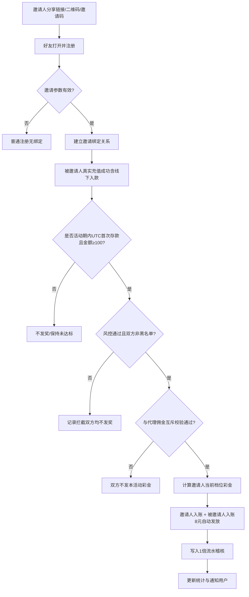

# 邀请好友送彩金 — 活动开发文档

> 文档角色：产品经理视角  
> 活动类型：邀请注册 + 首存达标双向发彩  
> 适用对象：全站会员  
> 文档版本：v1.3  
> 更新日期：2026-07-24  
> 变更说明：v1.3 按规则原文固化为「活动期间内首次存款 ≥ 100」（首笔单笔）；v1.2 累计口径作废；v1.1 其余拍板结论仍有效

---

## 一、活动概述

### 1.1 活动简介

会员通过推广链接或二维码邀请好友注册；被邀请好友在活动期间内完成**首次存款 ≥ 100 元**后，邀请人与被邀请人均可获得彩金。邀请人奖励按成功邀请人数阶梯递增，最高 **30 元/人**；被邀请人固定获得 **8 元**彩金。彩金自动发放至中心钱包，满足 **1 倍流水**后可提取。

### 1.2 活动基本信息

| 配置项 | 内容 |
|--------|------|
| 活动名称 | 邀请好友送彩金 |
| 活动开始时间 | 后台配置（UTC）；示例文案为 2021-09-15，**以新系统上线后配置为准** |
| 活动结束时间 | 后台可配置（UTC）；结束后停止发奖 |
| 时区 | **UTC**（活动起止、首存时间、统计日切均按 UTC） |
| 活动对象 | 全站会员 |
| 触发条件 | 被邀请人注册绑定 + 活动期间内首次存款 ≥ 100 元 |
| 首存口径 | **活动期间内首次存款金额 ≥ 100 元**（以活动期内第一笔真实充值成功单为准；非多笔累计） |
| 计入资金 | **真实充值成功订单**（含线上充值、**线下入款**）；不含活动赠金等非真实资金 |
| 邀请人奖励 | 阶梯彩金（见下表） |
| 被邀请人奖励 | 固定 8 元 |
| 流水要求 | 1.00 倍 |
| 发放方式 | 系统自动发放至中心钱包 |
| 与代理佣金 | **不可同得**（互斥） |
| 与其他优惠活动 | **可同时获得**（注册礼、首存礼等不互斥） |
| 历史数据 | **不补历史**；仅新系统上线后产生的绑定/达标生效 |

### 1.3 邀请人阶梯奖励表

| 成功邀请人数区间 | 单人邀请彩金（元） | 累计领取彩金示例（元） |
|------------------|--------------------|------------------------|
| 1 | 8.00 | 8.00 |
| 2 ~ 3 | 9.00 | 26.00 |
| 4 ~ 6 | 10.00 | 56.00 |
| 7 ~ 10 | 11.00 | 100.00 |
| 11 ~ 20 | 12.00 | 220.00 |
| 21 ~ 50 | 15.00 | 670.00 |
| 51 ~ 100 | 20.00 | 1670.00 |
| 101 及以上 | 30.00 | 1700.00 及以上 |

**计算规则说明（重要）：**

- 「成功邀请人数」= 被邀请人在活动期间内首次存款 ≥ 100 元、且通过风控校验、**双方均已发放奖励**的人数。
- 邀请人每成功邀请第 N 人时，按**当前累计成功人数所处档位**发放对应单人彩金，而非对历史邀请人补差。
- 被邀请人始终固定 8 元，与邀请人档位无关。

**举例校验：**

| 次序 | 邀请人档位彩金 | 被邀请人彩金 | 邀请人累计 |
|------|----------------|--------------|------------|
| 第 1 人 | 8 | 8 | 8 |
| 第 2 人 | 9 | 8 | 17 |
| 第 3 人 | 9 | 8 | 26 |
| 合计 | — | — | 邀请人 26 元（与活动文案一致） |

> 注：活动文案中「2~3 人累计 26」按第 1 人 8 + 第 2、3 人各 9 计算，开发以「按当前成功人数档位发当次奖励」为准。

---

## 二、核心业务规则

### 2.1 绑定关系建立

1. 邀请人分享推广链接 / 推广二维码 / 邀请码。
2. 好友通过上述渠道完成注册，系统建立「邀请人 — 被邀请人」绑定关系。
3. 绑定关系一旦建立不可变更（同一账号仅可被绑定一次）。
4. 非活动渠道注册（无邀请码/无推广参数）不产生邀请关系，不参与本活动。

### 2.2 发奖触发条件（需同时满足）

| 序号 | 条件 | 说明 |
|------|------|------|
| 1 | 绑定关系有效 | 注册时已绑定邀请人；且为**新系统上线后**产生的绑定 |
| 2 | 处于活动有效期内 | 活动起止按 **UTC**；以被邀请人充值成功时间（UTC）落在活动期内为准 |
| 3 | 活动期间内首次存款 ≥ 100 元 | 活动期间内，被邀请人**第一笔真实充值成功订单**金额 ≥ 100（含线上充值、线下入款） |
| 4 | 资金类型合法 | 仅真实充值；**不含**活动赠金、彩金转入等非真实资金入账 |
| 5 | 通过风控校验 | 见 2.4；邀请人或被邀请人任一侧不通过则**双方都不发** |
| 6 | 与代理佣金互斥通过 | 若该笔邀请关系已走代理/返佣收益，则**不可再领本活动彩金**（见 2.5） |
| 7 | 该被邀请人尚未发放过本活动奖励 | 防重复发奖（幂等） |

**首存口径说明（按规则原文已拍板）：**

- 规则原文：「好友在活动期间内**首次存款** ≥ 100 元时」。
- 「首次存款」= 活动期间内（UTC）该被邀请人的**第一笔**真实充值成功订单。
- 该笔订单金额必须 **≥ 100** 才达标；若第一笔 < 100，即使后续再充使总额 ≥ 100，**也不再触发**本活动。
- 计入：线上充值成功单、**线下入款**成功单。
- 不计入：活动赠金、彩金、非真实资金入账。
- 示例：活动期内首笔 100 → 达标；首笔 50 后再充 50/100 → **不达标**（首次存款未达 100）。

### 2.3 发奖逻辑

1. 被邀请人活动期间内首次存款达标，且风控、互斥校验通过后，系统计算邀请人**当前成功邀请人数 + 1** 所处档位，得到邀请人当次彩金金额。
2. 邀请人获得档位彩金，被邀请人获得固定 8 元；**任一侧不可发则两侧均不发**。
3. 双方彩金**系统自动发放**至中心钱包，并写入流水稽核（1 倍）。
4. 写入邀请成功记录、发奖流水、更新邀请人累计成功人数与累计彩金。
5. 活动结束后：新达标不再发奖；已达标未入账的不再发放。
6. 本活动彩金与其他注册/首存类优惠活动**可同时获得**，互不占用资格（与代理佣金除外）。

### 2.4 风控规则

同一以下信息的游戏账号，本活动仅可参与一次（邀请侧/被邀请侧均需校验）：

- 同一 IP
- 同一设备（设备指纹 / Device ID）
- 同一手机号
- 同一姓名
- 同一邮箱
- 同一银行卡号

违规 / 黑名单处理（已拍板）：

- 不享受本活动红利；已发可支持后台人工扣回/作废。
- **邀请人处于冻结/黑名单**：达标时**邀请人、被邀请人双方均不发奖**。
- **被邀请人处于冻结/黑名单**：双方均不发奖。
- 套利、对冲、不诚实行为：取消优惠资格，可冻结/关闭账号并列入黑名单。

### 2.5 与代理佣金、其他活动关系

| 关系 | 结论 | 实现要求 |
|------|------|----------|
| 本活动彩金 vs 代理/返佣 | **不可同得** | 发奖前校验该邀请关系是否已计入或将计入代理佣金；已领佣金则本活动双方不发；已领本活动彩金则该关系不再计佣（具体以代理系统对接约定为准，需两边落互斥标记） |
| 本活动彩金 vs 其他优惠（注册礼、首存礼等） | **可同时获得** | 不与其他活动做资格互斥；各自按自身规则发奖 |

### 2.6 流水与取款

- 彩金稽核倍数：1.00 倍（可后台配置）。
- 满足流水后方可提取。
- 稽核计算口径需与现有中心钱包流水体系对齐（有效投注定义沿用现有资金体系）。

### 2.7 边界与异常

| 场景 | 处理 |
|------|------|
| 活动结束前注册，结束后才首存 | 不发奖（首次存款成功时间须在活动期内 UTC） |
| 活动期内首次存款 < 100 | 不发奖；后续再充即使 ≥ 100 也不再触发 |
| 首存拆单（如 50+50） | **不支持累计**：以活动期内第一笔成功单为准，首笔须 ≥ 100 |
| 含赠金/非真实资金 | 不计入首次存款，不触发 |
| 线下入款 | **计入**（可作为首次存款） |
| 邀请人账号被冻结/黑名单 | **双方均不发奖** |
| 被邀请人账号被冻结/黑名单 | **双方均不发奖** |
| 该邀请已享受代理佣金 | **双方均不发本活动彩金** |
| 同时参与其他注册/首存活动 | **允许**，各自发奖 |
| 重复回调/重复入账 | 幂等：同一被邀请人本活动只发奖一次 |
| 邀请自己 / 互邀成环 | 禁止发奖 |
| 新系统上线前的历史邀请/存款 | **不回溯、不补发、不计入统计** |

---

## 三、数据后台（运营管理端）需求

### 3.1 活动配置模块

#### 3.1.1 基础配置

| 字段 | 类型 | 必填 | 说明 |
|------|------|------|------|
| 活动名称 | 文本 | 是 | 前台展示名称 |
| 活动状态 | 开关 | 是 | 开启 / 关闭 / 草稿 |
| 开始时间 | 日期时间 | 是 | UTC，如 2021-09-15 00:00:00 |
| 结束时间 | 日期时间 | 是 | UTC；建议强制填写 |
| 时区说明 | 只读 | 是 | 固定 UTC，前后台展示需标注 |
| 活动对象 | 枚举/多选 | 是 | 默认全站会员；可扩展 VIP 等级、注册时间等 |
| 活动入口图 / Banner | 图片 | 否 | 活动中心展示 |
| 活动规则文案 | 富文本 | 是 | 支持多语言（若站点有 i18n） |
| 排序权重 | 数字 | 否 | 活动列表排序 |

#### 3.1.2 奖励规则配置

| 字段 | 类型 | 说明 |
|------|------|------|
| 被邀请人固定彩金 | 金额 | 默认 8.00 |
| 邀请人阶梯表 | 可编辑列表 | 人数区间下限、上限、单人彩金 |
| 首存门槛金额 | 金额 | 默认 100.00 |
| 首存判定方式 | 固定 | **活动期间内首次存款（第一笔真实充值成功单）≥ 门槛**（已拍板，不做累计） |
| 计入资金类型 | 多选/固定 | 线上充值 + **线下入款**；排除赠金 |
| 流水倍数 | 小数 | 默认 1.00 |
| 发放钱包 | 枚举 | 默认中心钱包 |
| 发放方式 | 枚举 | **自动发放**（本活动） |
| 与代理佣金关系 | 枚举 | **互斥 / 不可同得**（本活动） |
| 与其他优惠活动 | 枚举 | **可同得**（本活动） |
| 活动结束后未发奖励处理 | 枚举 | 不再发放（本活动） |
| 历史数据策略 | 固定 | **仅新系统上线后生效，不补历史** |

阶梯表编辑能力：

- 支持增删改档位
- 保存时校验：区间连续、无重叠、无空洞；最高档支持「及以上」
- 支持预览累计示例（按档位模拟前 N 人累计）

#### 3.1.3 风控配置

| 字段 | 说明 |
|------|------|
| 唯一性校验维度开关 | IP / 设备 / 手机号 / 姓名 / 邮箱 / 银行卡（可多选） |
| 同邀请人下被邀请人设备/IP 重复策略 | 拒绝发奖 / 仅标记人工审核 |
| 黑名单联动 | 命中黑名单自动拒绝；**邀请人或被邀请人命中 → 双方都不发** |
| 自动发奖开关 | 本活动固定自动发放；关则可转人工审核队列（预留） |
| 与代理佣金互斥 | 开启（本活动必开） |
| 单日/活动期邀请人奖励上限 | 可选，防异常刷量 |

#### 3.1.4 推广物料配置

| 字段 | 说明 |
|------|------|
| 推广链接模板 | 含邀请码/UID 参数 |
| 二维码落地页 | H5 注册页 |
| 分享文案模板 | 标题、描述、缩略图 |
| 渠道标识 | 可选：区分链接/二维码/邀请码来源统计 |

### 3.2 邀请关系与发奖管理

#### 3.2.1 邀请关系查询

筛选项：

- 邀请人账号 / UID
- 被邀请人账号 / UID
- 绑定时间范围
- 是否已首存达标
- 是否已发奖
- 风控状态（正常 / 拦截 / 人工）

列表字段：

- 邀请人、被邀请人
- 绑定时间、注册 IP/设备
- 首存时间、首存金额、存款单号
- 邀请人当次档位、邀请人彩金、被邀请人彩金
- 发奖状态、发奖时间、流水单号
- 风控命中原因

操作：

- 查看详情
- 人工补发（需权限 + 操作日志）
- 人工取消/扣回（需权限 + 备注）
- 导出 Excel

#### 3.2.2 发奖记录

- 按奖励对象（邀请人/被邀请人）、金额、状态、时间查询
- 与资金账变、稽核记录关联跳转
- 失败重试队列（入账失败自动/手动重试）

#### 3.2.3 异常审核队列（可选但建议）

命中风控但未直接拒绝、或发奖失败的记录进入审核：

- 通过 → 触发发奖
- 拒绝 → 标记原因，不发奖
- 批量处理

### 3.3 数据统计模块

#### 3.3.1 活动概览看板（Dashboard）

| 指标 | 说明 |
|------|------|
| 活动UV / PV | 活动页访问 |
| 分享次数 | 复制链接 / 保存二维码 / 分享按钮点击 |
| 通过推广注册人数 | 有绑定关系的新注册 |
| 首存达标人数 | 成功触发发奖的被邀请人人数 |
| 注册→首存转化率 | 达标人数 / 推广注册人数 |
| 邀请人参与人数 | 至少成功邀请 1 人的会员数 |
| 发放彩金总额 | 邀请人 + 被邀请人合计 |
| 邀请人彩金总额 / 被邀请人彩金总额 | 拆分统计 |
| 人均成功邀请数 | 达标人数 / 有效邀请人 |
| 今日新增注册 / 达标 / 发放金额 | 日维度 |

支持按日/周/月切换；支持时间范围筛选。

#### 3.3.2 阶梯分布统计

- 各档位邀请人人数分布（当前成功人数落在哪一档）
- 各档位发放金额占比
- 头部邀请人排行（Top N：成功人数、累计彩金）

#### 3.3.3 转化漏斗

```
活动页访问 → 点击分享 → 落地注册页访问 → 完成注册绑定
→ 完成首存 → 首存≥100 → 风控通过 → 成功发奖
```

每一层展示人数与转化率，便于优化活动与风控误伤。

#### 3.3.4 风控统计

- 各维度拦截次数（IP/设备/手机号/银行卡等）
- 拦截率
- 疑似套利团伙聚类（同 IP/设备下多账号）

#### 3.3.5 财务报表

| 报表 | 内容 |
|------|------|
| 每日发放明细汇总 | 笔数、金额、成功/失败 |
| 彩金成本报表 | 按日/活动累计成本 |
| 稽核完成情况 | 已完成流水可提 / 未完成 |
| 补发/扣回审计报表 | 人工操作金额 |

支持导出；金额精度与账变一致（建议保留 2 位小数）。

### 3.4 权限与审计

- 配置修改、补发、扣回、导出需分权
- 所有关键操作写操作日志：操作人、时间、前后值、备注
- 敏感字段（银行卡、手机号）脱敏展示

---

## 四、用户端（C 端）需求

### 4.1 活动入口

1. 活动中心列表展示本活动（活动类型可复用现有「邀请活动 / 105」）。
2. 个人中心 / 推广分享页可增加本活动入口或说明。
3. 活动未开始：展示倒计时或「即将开始」。
4. 活动已结束：可查看历史规则与个人记录，但不可再获得新奖励。
5. 未登录点击参与：跳转登录/注册。

### 4.2 活动详情页

页面模块建议：

| 模块 | 内容 |
|------|------|
| 活动主视觉 | Banner + 活动时间 |
| 我的邀请数据 | 成功邀请人数、累计获得彩金、当前档位、下一档差额提示 |
| 奖励规则表 | 阶梯表 + 被邀请人固定 8 元说明 |
| 举例说明 | 与运营文案一致的计算示例 |
| 推广工具区 | 推广链接、二维码、邀请码；一键复制/保存/分享 |
| 邀请记录列表 | 好友账号（脱敏）、注册时间、首存状态、奖励状态/金额 |
| 活动规则 | 完整规则文案 |

交互要点：

- 未登录可看规则，登录后展示个人数据与推广工具。
- 复制链接、保存二维码需有成功反馈。
- 邀请记录支持下拉刷新；状态：待首存 / 已达标待发奖 / 已发奖 / 风控未通过（对用户文案需柔和，如「未达发放条件」）。

### 4.3 推广与注册链路

1. **分享**：生成带邀请参数的链接与二维码（与现有 `promotion-share` / 邀请码能力打通）。
2. **落地注册**：打开链接自动带入邀请码；注册页邀请码可只读或可编辑（产品建议：链接进入默认填充，仍允许修改则可能丢绑定，建议锁定来源邀请码）。
3. **注册成功**：建立绑定；可提示「完成首存 ≥100 元，双方可领彩金」。
4. **首存引导**：被邀请人活动期内未首存时，可在首页/活动页弱提示。

### 4.4 发奖结果触达

| 对象 | 触达方式 |
|------|----------|
| 邀请人 | 站内信 / 消息中心：「成功邀请 xxx，获得 y 元彩金」 |
| 被邀请人 | 站内信：「完成首存，获得 8 元彩金」 |
| 钱包 | 中心钱包余额增加；资金明细可见「邀请彩金」类账变 |
| 稽核 | 用户可在流水/稽核相关页面看到 1 倍要求（若现有资产页支持） |

### 4.5 用户端不需要做的（避免过度设计）

- 不需要用户手动「领取」（本活动为自动发放）。
- 不需要用户端配置阶梯（只读展示后台配置）。
- 不需要向普通用户展示详细风控命中原因。

---

## 五、系统流程设计

### 5.1 主流程



### 5.2 档位计算伪代码

```text
successCount = 邀请人历史成功邀请数（已发奖）
nextCount = successCount + 1
inviterBonus = 匹配阶梯表(nextCount).bonus
inviteeBonus = 固定配置.inviteeBonus  // 8.00

发放(邀请人, inviterBonus)
发放(被邀请人, inviteeBonus)
邀请人.successCount = nextCount
邀请人.totalBonus += inviterBonus
```

### 5.3 状态机（被邀请人维度）

| 状态 | 含义 |
|------|------|
| BOUND | 已绑定，尚未产生活动期内首次存款 |
| DEPOSITED_NOT_ELIGIBLE | 活动期内首次存款已发生但金额 < 100（不可再达标） |
| PENDING_RISK | 首次存款已达标，待风控/审核 |
| REWARDED | 已发奖 |
| REJECTED | 风控拒绝 |
| EXPIRED | 活动结束仍未产生达标首存 |

---

## 六、数据模型建议（供研发参考）

### 6.1 活动配置表 `promo_invite_config`

- 活动基础字段、时间、状态
- 首存门槛、流水倍数、发放钱包
- 被邀请人固定奖金
- 风控开关 JSON
- 规则文案、素材 URL

### 6.2 阶梯配置表 `promo_invite_tier`

- `activity_id`
- `min_count` / `max_count`（最高档 `max_count` 可空）
- `bonus_amount`

### 6.3 邀请绑定表 `promo_invite_bind`

- 邀请人 ID、被邀请人 ID（唯一）
- 绑定时间、来源（link/qr/code）
- 注册 IP、设备号等快照

### 6.4 发奖记录表 `promo_invite_reward`

- 绑定 ID、活动 ID
- 角色（inviter/invitee）
- 当时成功序号、档位、金额
- 存款订单号、发奖状态、账变单号
- 风控结果、备注
- 唯一约束：`(activity_id, invitee_id, role)` 保证幂等

### 6.5 统计日表 `promo_invite_stats_daily`（可异步汇总）

- 日期、注册数、达标数、发放金额、拦截数等

---

## 七、接口清单（建议）

### 7.1 用户端 API

| 接口 | 说明 |
|------|------|
| `GET /activity/invite/detail` | 活动详情、规则、阶梯、我的汇总 |
| `GET /activity/invite/records` | 我的邀请记录分页 |
| `GET /activity/invite/share` | 推广链接、二维码、邀请码 |
| `POST /activity/invite/share-event` | 上报复制/分享行为（可选，用于统计） |

### 7.2 后台 API

| 接口 | 说明 |
|------|------|
| 活动 CRUD / 启停 | 配置管理 |
| 阶梯配置保存校验 | 区间校验 |
| 邀请关系列表 / 导出 | 查询运营 |
| 发奖记录 / 补发 / 扣回 | 资金相关需强校验 |
| 统计看板 / 漏斗 / 排行 | 报表 |
| 风控拦截列表 / 审核 | 风控运营 |

### 7.3 内部事件/回调

| 事件 | 说明 |
|------|------|
| 用户注册成功 | 解析邀请参数并绑定（仅新系统上线后） |
| 真实充值成功（含线下入款） | 若为活动期内首笔真实充值：判断金额是否 ≥100，再走风控/互斥/发奖 |
| 活动到期任务 | 关闭入口、停止发奖、刷新状态（UTC） |

---

## 八、与现有系统联动点（结合本仓库）

| 现有能力 | 联动说明 |
|----------|----------|
| 注册邀请码（`pages/login`） | 推广落地自动填充/锁定邀请码，完成绑定 |
| 推广分享页（`pages/mine/promotion-share.vue`） | 复用邀请码、链接、二维码；可导流至本活动详情 |
| 活动类型 105「邀请活动」（`GameTypes` / `GameAPI`） | 活动中心展示与路由可挂靠该类型 |
| 中心钱包 / 账变 / 流水稽核 | 发奖入账、1 倍流水、取款拦截逻辑复用现有资金体系 |
| 线下入款 | 计入本活动「真实充值」首存判定 |
| 代理/返佣体系 | **互斥**：同一邀请关系不可同时拿佣金与本活动彩金 |
| 其他优惠活动 | **可同得**：不阻断注册礼/首存礼等 |
| 消息/站内信 | 发奖成功通知 |

---

## 九、验收标准（QA）

### 9.1 功能验收

- [ ] 无邀请参数注册不产生绑定
- [ ] 有邀请参数注册成功建立绑定且不可改绑
- [ ] 活动期内首次存款 < 100 不发奖；之后再充不补发
- [ ] 活动期内首次存款 ≥ 100（含线下入款）双方发奖金额正确
- [ ] 50+50 拆单不达标（首次存款口径，非累计）
- [ ] 赠金等非真实资金不作为首次存款、不触发
- [ ] 第 1/2/3 人邀请人金额分别为 8/9/9，累计 26
- [ ] 跨档位（如第 4 人）邀请人为 10，被邀请人仍为 8
- [ ] 彩金自动进入中心钱包，稽核 1 倍生效
- [ ] 活动结束后首存不再发奖
- [ ] 同 IP/设备/手机号/姓名/邮箱/银行卡重复参与被拦截
- [ ] 邀请人黑名单时双方都不发；被邀请人黑名单时双方都不发
- [ ] 已享代理佣金的邀请关系不发本活动彩金
- [ ] 同时领取其他注册/首存优惠不被本活动拦截
- [ ] 活动时间与统计按 UTC
- [ ] 上线前历史邀请/存款不回溯不补发
- [ ] 重复回调不重复发奖（幂等）
- [ ] 后台可配置阶梯、门槛、时间并即时影响新发奖
- [ ] 统计看板数字与明细账一致

### 9.2 文案与展示验收

- [ ] 用户端阶梯表、举例、规则与运营配置一致
- [ ] 邀请记录状态展示正确且脱敏

### 9.3 权限验收

- [ ] 无权限人员无法补发/扣回/改配置
- [ ] 敏感操作有日志可追溯

---

## 十、开发排期建议（供排期参考）

| 阶段 | 内容 | 建议人天（参考） |
|------|------|------------------|
| 需求冻结 | 首存口径、资金范围、黑名单、互斥、时区、上线范围已拍板 | 已完成 |
| 后端 | 配置、绑定、发奖、幂等、稽核、代理互斥、线下入款对接 | 4~6 |
| 后台前端 | 配置页、名单、报表、审核 | 3~5 |
| 用户端 | 活动页、分享、记录、消息 | 2~3 |
| 联调测试 | 资金/风控/互斥/UTC/边界用例 | 2~3 |
| 上线观察 | 监控发奖成功率、拦截率、成本；不补历史 | 1 |

---

## 十一、产品确认事项（已拍板）

| # | 议题 | 结论 |
|---|------|------|
| 1 | 首存口径 | **按规则原文**：活动期间内**首次存款 ≥ 100**；以活动期内第一笔真实充值成功订单金额判定；**不支持**多笔累计（如 50+50） |
| 2 | 「首次存款」资金范围 | **真实充值成功订单**，**包括线下入款**；不含活动赠金等非真实资金 |
| 3 | 邀请人黑名单时被邀请人是否发 8 元 | **不发**（双方均不发） |
| 4 | 与代理/返佣 | **不可同得**（互斥） |
| 5 | 与其他注册/首存优惠 | **可同时获得** |
| 6 | 时区 | **UTC** |
| 7 | 历史数据 | **仅新系统上线后生效**，不补历史、不回溯统计 |

---

## 十二、附录：活动规则原文要点（已确认，实现约束）

1. 分享推广二维码或链接，好友注册后绑定关系建立。  
2. 活动期内好友**首次存款 ≥ 100 元**，双方获彩；被邀请人固定 8 元；邀请人按人数档位递增，最高 30 元/人。  
3. 双方奖励**系统自动**发至中心钱包，1 倍流水可取款。  
4. 活动结束后奖励终止，未领取（未发放）彩金不再发放。  
5. 同一 IP、设备、手机号、姓名、邮箱、银行卡等仅可参与一次。  
6. 异常套利可冻结/关户/拉黑且不退还。  
7. 平台保留最终解释权。

---

**文档结束**
